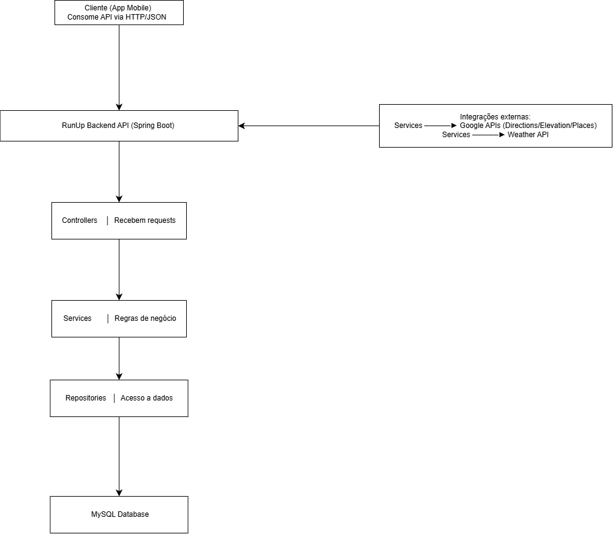

# RunUp

**Licenciatura em Engenharia Informática | LEIF02 | 24-25**  
**UC:** Projeto de Desenvolvimento Móvel  
**Docente:** Pedro Miguel Gomes Silva Rosa  
**Link Repósitorio** https://github.com/Dario8724/RunUp  
**Grupo 2** **Turma D02**

**Autores:**
- Gabriel Lima Rezende - 20240343  
- Dário Biaguê Bandanhe – 20241751  
- Edmilson Alberto Marcos Tudo – 20241542  
- Francisco Rocha Zolana – 20240801  

**Palavras Chave:**  
Corrida, Caminhada, RunUp, Saúde, Fitness

---

## Índice
- [Descrição da App](#descrição-da-app)
- [Descrição dos Objetivos e da Motivação do Trabalho](#descrição-dos-objetivos-e-da-motivação-do-trabalho)
- [Identificação de Público-Alvo](#identificação-de-público-alvo)
- [Pesquisa de Mercado](#pesquisa-de-mercado)
- [Versão Casos de Utilização](#versão-casos-de-utilização)
- [Descrição da Solução Implementada](#descrição-da-solução-implementada)
- [Arquitetura da Solução](#arquitetura-da-solução)
- [Diagrama de Classes](#diagrama-de-classes)
- [Documentação REST](#documentação-rest)
- [Dicionário de Dados](#dicionário-de-dados)
- [Guia de Dados](#guia-de-dados)
- [Manual do Utilizador](#manual-do-utilizador)
- [Planeamento e Gráfico de Gantt](#planeamento-e-gráfico-de-gantt)
- [Conclusão](#conclusão)
- [Poster](#poster)
- [Bibliografia](#bibliografia)

---

## Descrição da App

O grupo desenvolveu uma aplicação direcionada à comunidade de corredores e caminhantes, com foco especial em utilizadores iniciantes que procuram apoio no planeamento e acompanhamento dos seus treinos. O principal objetivo do app é oferecer uma experiência personalizada, prática e motivadora.
A aplicação permite gerar rotas dinâmicas com base em filtros definidos pelo utilizador, como distância, tempo, dificuldade ou localização, tornando o planeamento dos treinos mais flexível e adaptado às necessidades individuais. Adicionalmente, o sistema disponibiliza metas personalizadas, ajustadas ao perfil e ao ritmo de evolução de cada utilizador, reforçando o acompanhamento da sua progressão.
O app também conta com um histórico completo de atividades, permitindo ao utilizador consultar treinos anteriores, comparar desempenhos e acompanhar a sua evolução ao longo do tempo. Para além disso, integra uma funcionalidade que apresenta rotas populares pela cidade de Lisboa, ajudando os corredores a descobrir percursos conhecidos e adequados à prática desportiva.
Com estas funcionalidades, o projeto pretende proporcionar uma plataforma intuitiva, acessível e motivadora, capaz de apoiar o utilizador em cada etapa da sua jornada desportiva.

**Tabela de Tarefas**

| Atividades | Gabriel Rezende | Dário Bandanhe | Francisco Zolana | Edmilson Tudo |
| ------------- | ------------- | ------------- | ------------- |  ------------- |
| Base de Dados | 70% | 10% | 10% | 10% |
| Back End      | 45% | 5% | 35% | 5% |
| Front End     | 20% | 65% | 5% | 10% |
| Relatorios/Apresentações/Video| 25% | 25% | 25% | 25% |

**Funcionalidades:**
- Criação de rotas personalizadas (filtros: km, elevação, parques, praia, sol, etc.)
- Histórico de corridas/caminhadas
- Metas personalizidas para usuários 
- Monitoriamento de estatísticas pessoais
- Configuração de conta e metas
- Rotas populares e predefinidas para Lisboa
 
---

## Descrição dos Objetivos e da Motivação do Trabalho

A prática regular da caminhada e corrida é um dos mais simples e acessíveis modos de se manter uma vida saudável, ajudando a: diminuir a inatividade; prevenir doenças cardiovasculares; minimizar o estresse e a ansiedade; aumentar a qualidade do sono e o humor. O projeto oferece incentivo a estes hábitos de maneira prática, controlada e motivadora.
Acompanhamento de desempenho e progresso, a falta de progresso é um dos fatores que afastam as pessoas da atividade. O projeto pode contribuir com isso ao: Ressaltar as métricas (distância, tempo, velocidade, calorias); proporcionar comparações com atividades anteriores; propor desafios pessoais e em grupo. Esse acompanhamento estimula a continuidade da atividade, visto que os usuários conseguem visualizar sua progressão ao longo do tempo. Inclusão digital e acessibilidade nos dias atuais 95% das pessoas possui um smartphone com GPS. O projeto utiliza essa tecnologia disponível para oferecer: Um sistema acessível (sem custos com equipamentos caros), fácil de usar por pessoas de todas as idades, possibilidade de participação em programas sociais, escolares ou comunitários, integração social e comunitária. 

---

## Identificação de Público-Alvo

- Corredores iniciantes e caminhantes  
- Pessoas que buscam saúde e lazer  
- Comunidade digital e social ligada ao desporto  

---

## Pesquisa de Mercado

Strava = Registra Rotas, Quilômetros, Pagina de Comunidade porém maioria das opções são pagas.

Adidas Running = Registra Quilômetros, Elevação, Kcal.

Nike Running = Faz tudo que os demais e define metas.

Marcas como PUMA,Under Armor e New Balance também possuem aplicações.

Nenhuma das aplicações são totalmente gratuitas, para conseguir acessar todas funcionalidades precisa pagar uma assinatura. 

---

## Versão Casos de Utilização

1. **Novo usuário (23 anos, sedentário,estudante universitário, nunca correu antes, quer melhorar saúde):**
   
    • Cena: Ele baixa o app motivado por anúncios sobre “começar a correr de forma gradual”.
   
    •	Ação na app:
        o	Cria uma conta e responde um questionário inicial sobre nível de atividade. 
        o	A app sugere metas iniciais: caminhada leve de 2 km 3x por semana.
        o	Explora o filtro de rotas para encontrar rotas curtas, seguras e arborizadas. 
        o	Usa a aba de comunidade para ver depoimentos de outros iniciantes.
        o	Salva o histórico para acompanhar evolução semana a semana.
   
    •	Objetivo: Ganhar motivação, sentir-se seguro ao começar devagar, criar hábito. 

2. **Corredor experiente (35 anos, já corre 5x/semana, usa outros apps, mas quer algo mais completo e gratuito.):**
   
    •	Cena: Ele baixa a app depois de ver que há filtros de rota “à beira-mar” e “mais ensolaradas”.

    •	Ação na app: 
        o	Usa o filtro avançado para criar rotas longas (10–15 km) com paisagens variadas. 
        o	Testa a funcionalidade “criar sua própria rota” para um treino específico.
        o	Define metas de performance (tempo/km). 
        o	Utiliza as rotas populares da comunidade.
   
    •	Objetivo: Avaliar se a app oferece mais personalização e motivação que os concorrentes.
   
3. **Corredor motivando amigo (28 anos, já corre há 3 anos; o amigo é sedentário, mas curioso.):**
   
    •	Cena: Encontro num parque. Ele abre a app para mostrar as funções ao amigo.
   
    •	Ação na app: 
        o	Mostra ao amigo os filtros de rota para iniciantes e caminhadas leves.
        o	Demonstra a aba de metas personalizadas para diferentes níveis. 
        o	Cria uma rota curta compartilhável para fazerem juntos. 
        o	Mostra a aba da comunidade, onde é possível acompanhar progresso e receber incentivos. 
        o	Agenda uma meta conjunta de corrida leve no fim de semana.
   
    •	Objetivo: Tornar a app atraente para o amigo e motivá-lo a começar com metas realistas.

---
## Descrição da Solução Implementada

- Aplicação mobile gratuita com **geolocalização e registo em tempo real**  
- Criação de rotas personalizadas (distância, áreas verdes, praias, sol, etc.)  
- Histórico de corridas e estatísticas  
- Integração com Google Maps SDK e Fused Location Provider  
- Base de dados (SQLite/MySQL) para registo de atividades

**Desenvolvimento da Base de Dados**
A modelagem da base de dados foi projetada para suportar as principais funcionalidades: registo de utilizadores, armazenamento de atividades (corridas e caminhadas), definição de metas, postagem em comunidades e rotas predefinidas populares.
A base foi estruturada seguindo o modelo relacional, utilizando MySQL (em ambiente de desenvolvimento via SQL Workbench).

**Tabelas Principais**
- Meta
- MU (Meta - Usuário)
- Usuário
- Corrida
- Tipo
- Postagem
- Rota
- CR (Características - Rota)
- LR (Local - Rota)
- Local

O relacionamento entre as tabelas foi definido da seguinte forma:
Um usuário pode ter varias metas (semanais e mensasis), o mesmo pode ter varias corridas. Uma corrida tem varias postagens, mas um tipo tem de exércicio tem varias corridas. Já uma rota tem varias corridas e nessa rota tem varias características.
A mesma rota passa por varios locais.

Implementação:
A base foi criada e testada com comandos SQL para inserção, atualização e consulta dos dados.

**Modelagem do Sistema**

**Desenvolvimento no Android studio:**
O projeto foi criado no Android Studio utilizando Kotlin como linguagem principal.  
A arquitetura adotada segue o padrão MVC (Model-View-Controller) para facilitar a separação entre interface, lógica e dados.  
Telas desenvolvidas:  
- Tela de Login.
- Tela de Registro.
- Tela Inicial.
- Tela de Gerar Rotas.
- Tela de Corrida.
- Tela de Histórico de Corrida.
- Tela de Comunidade.
- Tela de Perfil.
- Tela de Rotas Predefinidas.
- Tela de Política de Privacidade.
- Tela de Configuração de Metas.
- Tela de Configuração de Conta.

**Áreas curriculares envolvidas:**
- **Base de Dados**: SQLite/MySQL  
- **Programação Mobile**: Android Studio + Java  
- **POO**: Classes de Usuário, Atividade, Localização  
- **Matemática Discreta**: Grafos e algoritmos de caminhos  
- **Competências Comunicacionais**: Poster, vídeo promocional, design  

**Tecnologias:**  
- IDE: Android Studio  
- Linguagem: Java  
- Banco: SQL Workbench  
- APIs: Google Maps SDK, Fused Location Provider, Directions API  
- UI: Figma  
- Versionamento: GitHub / ClickUp  

---
## Arquitetura da Solução

Arquitetura da Solução (RunUp)

O sistema RunUp segue uma arquitetura em camadas baseada no padrão MVC, implementada em Spring Boot. A comunicação entre cliente e servidor é feita através de API REST, usando HTTP e JSON.
A camada Controller é responsável por expor os endpoints REST e receber pedidos do cliente (ex.: autenticação, criação de corrida, consulta de histórico). Em seguida, os controllers delegam o processamento para a camada Service, onde estão concentradas as regras de negócio (ex.: geração de rota, cálculo de métricas, atualização de metas e estatísticas).
A camada Repository implementa o acesso à base de dados através do Spring Data JPA, isolando a persistência e permitindo que a lógica de negócio não dependa diretamente do banco. A base de dados utilizada é MySQL, responsável por armazenar utilizadores, corridas, metas e rotas.
Além disso, a camada de serviços comunica com integrações externas para enriquecer a funcionalidade do sistema, como APIs de mapas (Google Directions/Elevation/Places) para geração de rotas e uma API meteorológica para obter condições de tempo associadas à corrida. Dessa forma, o RunUp mantém separação clara de responsabilidades, facilita manutenção e segue boas práticas de arquitetura de software.

---
## Diagrama de classes

---
## Documentação REST

[Documentação REST](./Imagens/Documentacao_REST.md)

---
## Dicionário de Dados

[Dicionário de Dados](./Imagens/Dicionario_de_Dados_Final.pdf)

---
## Guia de Dados 

[Guia de Dados](./Imagens/Guia_de_dados.pdf)

---
## Manual do Utilizador

[Manual do Utilizador](./Imagens/Manual_do_Utilizador.pdf)

---
## Planeamento e Gráfico de Gantt

**Planeamento da Primeira Entrega:**  

**Relatório:** 
https://sharing.clickup.com/90151732973/l/h/6-901516154823-1/55fb7423f59fccd

**Apresentação:** 
https://sharing.clickup.com/90151732973/l/h/6-901516845483-1/0371406d01dd78d

**Mockup do App:** 
https://sharing.clickup.com/90151732973/l/h/6-901516846221-1/4175765f3ea36a3

**Planeamento da Segunda Entrega:** 

**Relatório:** 
https://sharing.clickup.com/90151732973/l/h/6-901516849086-1/8e6cda7d33cf1e9

**Apresentação:** 
https://sharing.clickup.com/90151732973/l/h/6-901516849098-1/93044a1a73ebd3d

**Base de Dados:** 
https://sharing.clickup.com/90151732973/l/h/6-901516849110-1/a8afde9611b2ab9

**Front End:** 
https://sharing.clickup.com/90151732973/l/h/6-901516849113-1/f871e9413fe18ee

**Back End:** 
https://sharing.clickup.com/90151732973/l/h/6-901516849116-1/1b56a8c8c3f830f

**Planeamento da Terceira Entrega:** 

**Relatorio:** 
https://sharing.clickup.com/90151732973/l/h/6-901516850923-1/c946c754369f23e

**Apresentação:** 
https://sharing.clickup.com/90151732973/l/h/6-901516850928-1/c54a09d56a62cbe

**FrontEnd:** 
https://sharing.clickup.com/90151732973/l/h/6-901516850938-1/36332eeb3613f30

**BackEnd:** 
https://sharing.clickup.com/90151732973/l/h/6-901516850944-1/e86ca774d0d424a

**Base de Dados:** 
https://sharing.clickup.com/90151732973/l/h/6-901517767055-1/e2b904408bf59e5

---

## Conclusão

Nesta última fase de desenvolvimento do RunUp, o projeto teve um grande imprevisto onde tivemos de fazer a alteração total da base de dados e com isso causou grandes problemas com as ligações com o backend e com frontend gerando mudanças em todo o projeto. Porém essa mudança demonstrou avanços significativos na estrutura técnica quanto à consolidação do conceito inicial. A implementação da nova base de dados, a mudança do backend devido a nova base de dados e os ajustes no frontend permitiram transformar o projeto mais robusto e mais profissional. A integração entre a nova base de dados e frontend marcou um ponto importante, pois estabeleceu o fluxo real de dados e aprimorou a coleta e armazenamento de dados da aplicação.
Durante essa última etapa, o grupo enfrentou desafios relacionados a colaboração do desenvolvimento do projeto de outros participantes, os mesmos não solicitaram auxílio às dificuldades enfrentadas nas tarefas a si e também não informaram sobre os estados das tarefas, causando assim muitos atrasos no cronograma e sobrecarregando outros integrantes que tiveram de fazer as tarefas que não foi designada a eles. Devido a esse imprevisto não conseguimos trazer uma parte de comunidade para nosso projeto, onde a ideia inicial era criar apenas um feed onde os usuário iriam compartilhar suas rotas, mas após a segunda entrega decidimos mudar para uma ideia mais robusta onde as postagens iriam ter uma parte de interação com outros usuário e também criamos um feed de desafios da comunidade ou opções de desafios criados por outros usuários.
O Runup manteve como objetivo central a primeira proposta do projeto, só deixamos mais robustos as funcionalidades como: as metas pessoais de cada usuário, rotas populares predefinidas e histórico de corridas.

---

## Poster 

---
## Bibliografia

1. **Google Maps Platform – APIs by Platform**  
   Disponível em: https://developers.google.com/maps/apis-by-platform?hl=pt-br  

2. **“Corrida foi o esporte que mais cresceu no mundo em 2024”, diz relatório**  
   Saúde Abril. Disponível em: https://saude.abril.com.br/fitness/corrida-foi-o-esporte-que-mais-cresceu-no-mundo-em-2024-diz-relatorio/  

3. **Os Melhores Apps de Corrida: Qual Escolher para Melhorar Seu Desempenho?**  
   Az on Esportes. Disponível em: https://azonesportes.com.br/app-de-corrida/  

---

