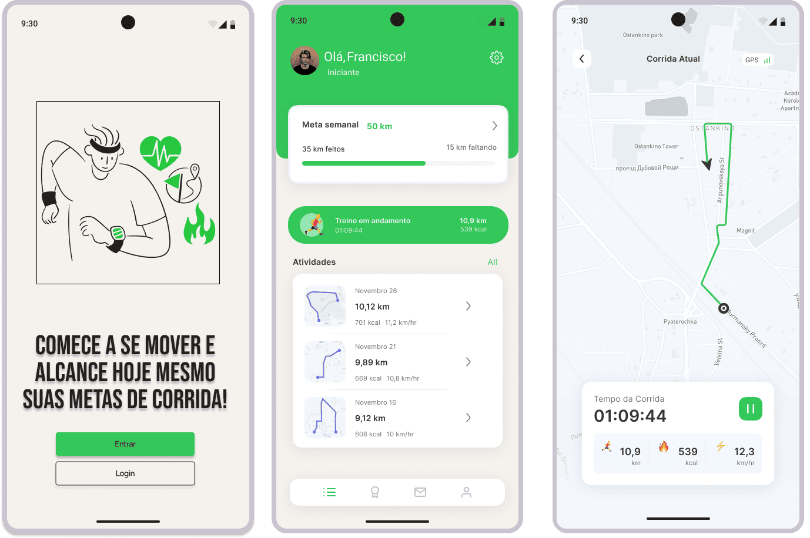

# RunUp

**Licenciatura em Engenharia Informática | LEIF02 | 24-25**  
**UC:** Projeto de Desenvolvimento Móvel  
**Docente:** Pedro Miguel Gomes Silva Rosa  
**Grupo 2** **Turma D02**

**Autores:**
- Gabriel Lima Rezende - 20240343  
- Dário Biaguê Bandanhe – 20241751  
- Edmilson Alberto Marcos Tudo – 20241542  
- Francisco Rocha Zolana – 20240801  

**Palavras Chave**
Corrida, Caminhada, RunUp, Saúde, Fitness

---

## Índice
- [Descrição da App](#descrição-da-app)
- [Requisitos Funcionais e Não Funcionais](#requisitos-funcionais-e-não-funcionais)
- [Objetivos e Motivação](#descrição-dos-objetivos-e-da-motivação-do-trabalho)
- [Público-Alvo](#identificação-de-público-alvo)
- [Pesquisa de Mercado](#pesquisa-de-mercado)
- [Guiões Preliminares](#uma-versão-preliminar-de-três-guiões)
- [Solução a Implementar](#descrição-da-solução-a-implementar)
- [Planeamento e Calendarização](#planeamento-e-calendarização)
- [Mockup da Aplicação](#mockup-da-aplicação)
- [Conclusão](#conclusão)
- [Poster do Aplicativo](#poster)
- [Bibliografia](#bibliografia)

---

## Descrição da App

O nosso grupo pretende desenvolver uma aplicação de corridas com o foco na comunidade de corredores e praticantes de desporto para o controle e gestão dos seus treinos, com o foco principal em corredores e caminhantes iniciantes na criação de rotas e armazenamentos de treinos anteriores.

**Funcionalidades previstas:**
- Criar rotas personalizadas (filtros: km, elevação, parques, praia, sol, etc.)
- Histórico de corridas
- Sugestão de metas para iniciantes
- Corrida ou caminhada
- Gravação de treinos (pace, tempo, recordes, etc.)
- Comunidade para partilha de corridas
- Registo de utilizadores
- Histórico de elevação
- Definir metas pessoais

Pretende-se com isso diminuir a falta de variedade e dificuldades no planejamento de distâncias e percursos nos treinos, sugerindo rotas/ percursos novas personalizadas para os utilizadores e calculando a quilometragem desejada. Também pretendemos aumentar o engajamento social entre os utilizadores através da aba da comunidade.

---

## Requisitos Funcionais e Não Funcionais

**Funcionais:**
- Criar rotas personalizadas  
- Registrar histórico de corridas  
- Sugerir metas  
- Selecionar tipo de atividade  
- Gravar estatísticas  
- Aba da comunidade  
- Definir metas pessoais  

**Não Funcionais:**
- Interface responsiva  
- Baixo consumo de bateria  
- Segurança de dados  
- Permissões de sistema  
- Escalabilidade  
- Privacidade  

---

## Descrição dos Objetivos e da Motivação do Trabalho

A prática regular da caminhada e corrida é um dos mais simples e acessíveis modos de se manter uma vida saudável, ajudando a: diminuir a inatividade; prevenir doenças cardiovasculares; minimizar o estresse e a ansiedade; aumentar a qualidade do sono e o humor. O projeto oferece incentivo a estes hábitos de maneira prática, controlada e motivadora.
Acompanhamento de desempenho e progresso, a falta de progresso é um dos fatores que afastam as pessoas da atividade. O projeto pode contribuir com isso ao: Ressaltar as métricas (distância, tempo, velocidade, calorias); proporcionar comparações com atividades anteriores; propor desafios pessoais e em grupo. Esse acompanhamento estimula a continuidade da atividade, visto que os usuários conseguem visualizar sua progressão ao longo do tempo. Inclusão digital e acessibilidade nos dias atuais 95% das pessoas possui um smartphone com GPS. O projeto utiliza essa tecnologia disponível para oferecer: Um sistema acessível (sem custos com equipamentos caros), fácil de usar por pessoas de todas as idades, possibilidade de participação em programas sociais, escolares ou comunitários, integração social e comunitária. 

---

## Identificação de Público-Alvo

- Corredores iniciantes e caminhantes  
- Pessoas que buscam saúde e lazer  
- Comunidade digital e social ligada ao desporto  

---

## Pesquisa de Mercado

Strava - Registra Rotas, Quilômetros, Pagina de Comunidade porém maioria das opções são pagas
Adidas Running - Registra Quilômetros, Elevação, Kcal
Nike Running - Faz tudo que os demais e define metas
Marcas como PUMA,Under Armor e New Balance também possuem aplicações
Nenhuma das aplicações são totalmente gratuitas, para conseguir acessar todas funcionalidades precisa pagar uma assinatura. 

---

## Uma Versão Preliminar de Três Guiões

1. **Novo usuário (23 anos, sedentário,estudante universitário, nunca correu antes, quer melhorar saúde):**
   
    • Cena: Ele baixa o app motivado por anúncios sobre “começar a correr de forma gradual”.
   
    •	Ação na app:
        o	Cria uma conta e responde um questionário inicial sobre nível de atividade. 
        o	A app sugere metas iniciais: caminhada leve de 2 km 3x por semana.
        o	Explora o filtro de rotas para encontrar rotas curtas, seguras e arborizadas. 
        o	Usa a aba de comunidade para ver depoimentos de outros iniciantes.
        o	Salva o histórico para acompanhar evolução semana a semana.
   
    •	Objetivo: Ganhar motivação, sentir-se seguro ao começar devagar, criar hábito. 

2. **Corredor experiente (35 anos, já corre 5x/semana, usa outros apps, mas quer algo mais completo e gratuito.):**
   
    •	Cena: Ele baixa a app depois de ver que há filtros de rota “à beira-mar” e “mais ensolaradas”.

    •	Ação na app: 
        o	Usa o filtro avançado para criar rotas longas (10–15 km) com paisagens variadas. 
        o	Testa a funcionalidade “criar sua própria rota” para um treino específico.
        o	Define metas de performance (tempo/km). 
        o	Interage na comunidade postando resultados e vendo desafios semanais.
   
    •	Objetivo: Avaliar se a app oferece mais personalização e motivação que os concorrentes.
   
3. **Corredor motivando amigo (28 anos, já corre há 3 anos; o amigo é sedentário, mas curioso.):**
   
    •	Cena: Encontro num parque. Ele abre a app para mostrar as funções ao amigo.
   
    •	Ação na app: 
        o	Mostra ao amigo os filtros de rota para iniciantes e caminhadas leves.
        o	Demonstra a aba de metas personalizadas para diferentes níveis. 
        o	Cria uma rota curta compartilhável para fazerem juntos. 
        o	Mostra a aba da comunidade, onde é possível acompanhar progresso e receber incentivos. 
        o	Agenda uma meta conjunta de corrida leve no fim de semana.
   
    •	Objetivo: Tornar a app atraente para o amigo e motivá-lo a começar com metas realistas.

---

## Descrição da Solução a Implementar

- Aplicação mobile gratuita com **geolocalização e registo em tempo real**  
- Criação de rotas personalizadas (distância, áreas verdes, praias, sol, etc.)  
- Histórico de corridas e estatísticas  
- Integração com Google Maps SDK e Fused Location Provider  
- Base de dados (SQLite/MySQL) para registo de atividades  

**Áreas curriculares envolvidas:**
- **Base de Dados**: SQLite/MySQL  
- **Programação Mobile**: Android Studio + Java  
- **POO**: Classes de Usuário, Atividade, Localização  
- **Matemática Discreta**: Grafos e algoritmos de caminhos  
- **Competências Comunicacionais**: Poster, vídeo promocional, design  

**Tecnologias:**  
- IDE: Android Studio  
- Linguagem: Java  
- Banco: SQL Workbench  
- APIs: Google Maps SDK, Fused Location Provider, Directions API  
- UI: Figma  
- Versionamento: GitHub / ClickUp  

---

## Planeamento e Calendarização

- Mockups e interface (Figma)  
- Desenvolvimento da base de dados (SQL Workbench)  
- Desenvolvimento front-end (Android Studio)  
- Integração com APIs (Google Maps SDK)  
- Testes e validação  
- Criação de poster e vídeo promocional  

---

## Mockup da Aplicação

# Mockup Interativo

[Ver mockup completo no Figma](https://www.figma.com/make/trREFBKUoFakKsm9PVs8au/RunUp-Mobile-App-Mockups?node-id=0-1&t=bzRYL2e4k7qEW83n-1)

---

## Conclusão

Atualmente, todo mundo precisa ter acesso à internet e às ferramentas digitais. Então, com base na prática de atividades físicas o projeto surgiu pensando nisso para:  
•	Ajudar todo mundo a começar a caminhar ou correr, mesmo quem nunca fez isso antes
•	Deixar tudo fácil, com ferramentas bem simples de usar
•	Mostrar como a internet pode ser útil, com uma app que qualquer pessoa consegue usar, tipo idosos ou quem tem alguma dificuldade.  
A ideia do projeto é: Dar um empurrãozinho para ter hábitos mais saudáveis com a ajuda da Tecnologia. Garantir que as pessoas se sintam seguras e engajadas quando   
estiverem se exercitando. Ajudar cada um a melhorar, acompanhando o seu progresso. Fazer com que mais gente tenha acesso à saúde e ao bem-estar, sem distinção.

---

## Poster 

[Poster do aplicativo](./Imagens/Poster_RunUp.pdf)

---
## Bibliografia

1. **Google Maps Platform – APIs by Platform**  
   Disponível em: https://developers.google.com/maps/apis-by-platform?hl=pt-br  

2. **“Corrida foi o esporte que mais cresceu no mundo em 2024”, diz relatório**  
   Saúde Abril. Disponível em: https://saude.abril.com.br/fitness/corrida-foi-o-esporte-que-mais-cresceu-no-mundo-em-2024-diz-relatorio/  

3. **Os Melhores Apps de Corrida: Qual Escolher para Melhorar Seu Desempenho?**  
   Az on Esportes. Disponível em: https://azonesportes.com.br/app-de-corrida/  

---

